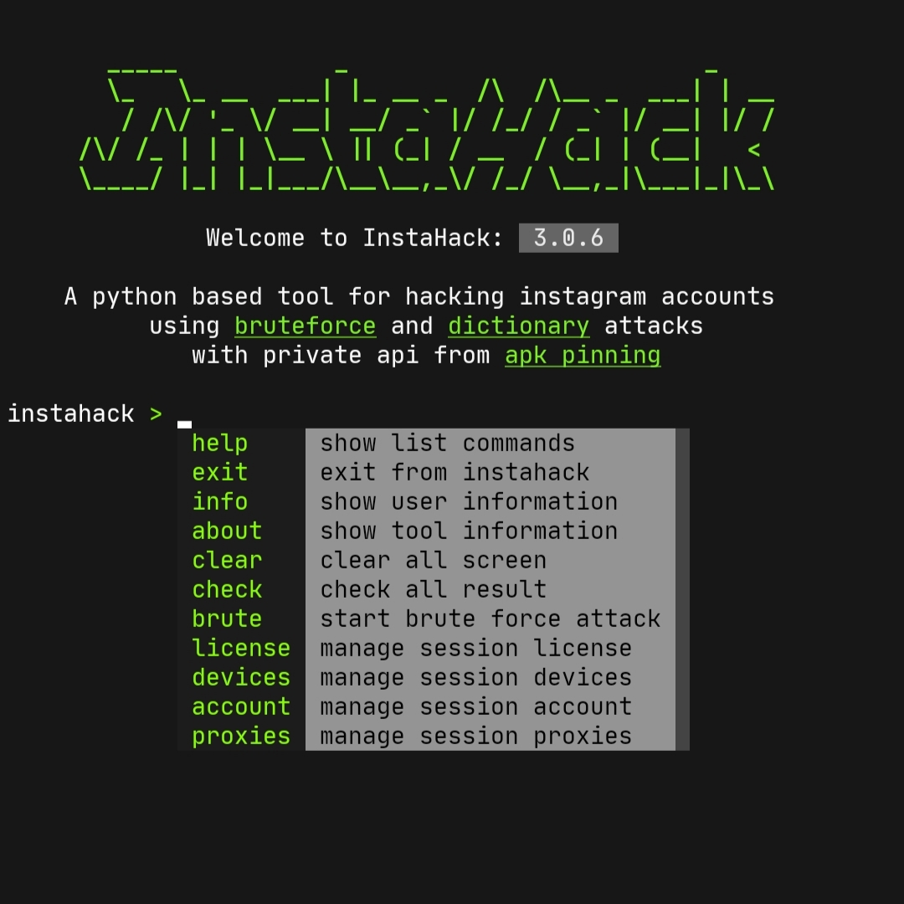

  


**InstaHack**: A python-based tool for hacking instagram accounts using brute force and dictionary attacks with private api from latest apk pinning

### how to install instahack
make sure you have installed **python** with version **3.10.x**
```bash
python3 --version
```
install with pip
````bash 
pip3.10 install ihack
pip3.10 install --upgrade ihack
````
running instahack
```bash
ihack
```

[](https://asciinema.org/a/703351)

### how to buy instahack license key
* run instahack with ```ihack```
* type ```register``` in license key input
* open the register link ```redirect to whatsapp```

### how to start brute force ?
Here's how to start **Brute Force**
[](https://asciinema.org/a/703393)

### what's the features ?
```text
* login with multiple accounts (cookies)
* login with customize devices (avoid suspicious login)
* proxy scraper with customize url (raw/text)
* proxy rotator (avoid spam & blocked ip)
* brute force from random email (no cookie required)
* brute force from random username (no cookie required)
* brute force from public username (cookie required)
* brute force from stored dump files (no cookie required)
* login method with private api from latest apk pinning
* option for show checkpoint accounts
* option for using password encryption
* option for using password capitalize
* option for custom password combolist
* option for add custom password 
* manage account results easily (json)
* manage session account, devices, proxies easily
```
### maintener
<p align="center">
  
  <br>
  <b>Iqbalmh18</b>
  <br>
  <a href="https://github.com/iqbalmh18" target="_blank" style="color: black; text-decoration: none;">
    GitHub Profile
  </a>
  <br>
  <a href="https://instagram.com/iqbalmh18" target="_blank" style="color: black; text-decoration: none;">
    Instagram Profile
  </a>
</p>

### about
**Developed since February 1, 2023**

This tool takes advantage of user carelessness
by using easy-to-guess passwords by simply combining
public details in the profile like their name & username
maintained from version 1.0.0 until now version 3.0.5
